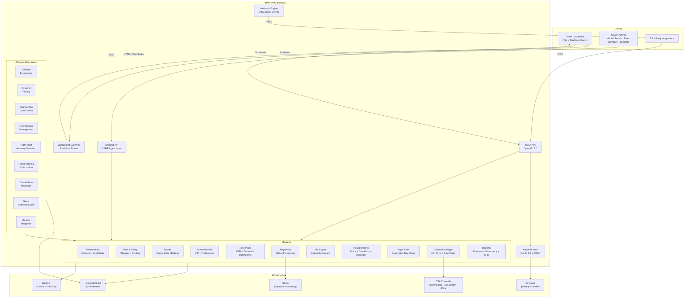

<p align="center">
  
</p>

<h1 align="center">HAIP — Hotel AI Platform</h1>

<p align="center">
  <strong>The open-source, API-first hotel PMS where AI agents are first-class citizens.</strong>
</p>

<p align="center">
  <a href="https://github.com/telivity-otaip/haip/actions"></a>
  
  
  
  
  
  
</p>

<p align="center">
  <a href="#what-is-haip">What is HAIP</a> &middot;
  <a href="#architecture">Architecture</a> &middot;
  <a href="#ai-agents">AI Agents</a> &middot;
  <a href="#features">Features</a> &middot;
  <a href="#tech-stack">Tech Stack</a> &middot;
  <a href="#quick-start">Quick Start</a> &middot;
  <a href="#api-reference">API Reference</a> &middot;
  <a href="#otaip-integration">OTAIP Integration</a> &middot;
  <a href="#contributing">Contributing</a>
</p>

---

## What is HAIP

The hotel industry runs on closed-source, legacy PMS platforms that charge per-room fees, lock data behind proprietary APIs, and treat integrations as an afterthought. Hotels pay $5–15/room/month just for the privilege of managing their own operations.

HAIP is a **complete, production-grade hotel Property Management System** built from scratch with modern architecture. Reservation lifecycle, folio & billing, rate plans, housekeeping with digital checklists, night audit, channel distribution to 450+ OTAs, Stripe payment processing, Keycloak authentication, tax calculation engine, revenue management — and **9 built-in AI agents** that optimize revenue, predict cancellations, detect audit anomalies, schedule housekeeping, automate guest communications, and draft review responses. All open source under Apache 2.0.

What makes HAIP different is that **AI agents are built into the architecture from day one** — not as a bolt-on, but as first-class citizens with their own lifecycle, decision logging, and learning loop. HAIP is the sister project to [OTAIP](https://github.com/telivity-otaip/otaip) (Open Travel AI Platform). Together they form **Telivity's open-source travel infrastructure**. OTAIP agents connect to HAIP via the Connect API — the PMS works without AI, but the AI makes it extraordinary.

### What HAIP is NOT

HAIP is not a wrapper around another PMS. It's not a booking widget. It's not a SaaS dashboard with "AI" slapped on the marketing page. It's a real PMS with real hotel operations logic — night audits at 3am, folio routing rules, rate parity enforcement, guest registration compliance across jurisdictions.

---

## Architecture



**Option B Architecture** — The PMS is standalone. It works without OTAIP. OTAIP agents sit on top via the Connect API, using purpose-built endpoints for AI agent workflows. This is the [Apaleo](https://apaleo.com) model, done open source.

### Key Design Decisions

- **Multi-tenant from day one** — `property_id` on every table, designed for portfolio operators managing multiple hotels
- **Event-driven** — Webhook events on every state change (`reservation.created`, `folio.charge_posted`, `room.status_changed`). Build anything on top.
- **AI agents as first-class citizens** — 9 built-in agents with a common interface: `analyze() → recommend() → execute()`. Three operating modes: manual, suggest, autopilot. Decision logging for continuous learning.
- **ChannelAdapter pattern** — Same abstraction as OTAIP's ConnectAdapter. Booking.com direct adapter + SiteMinder adapter for 450+ OTA reach
- **Keycloak RBAC** — JWT authentication with role-based access control (admin, front_desk, housekeeping, revenue_manager). Guards on every endpoint.
- **Compliance as infrastructure** — PCI tokenization (Stripe), GDPR audit trails, jurisdiction-based tax calculation, guest registration per jurisdiction. Not bolted on — built in.
- **Real-time dashboard** — WebSocket broadcasting per property. Room status changes, new reservations, AI agent decisions — all pushed instantly.

---

## AI Agents

HAIP includes **9 built-in AI agents** — 4 for revenue management, 3 for operations intelligence, and 2 for guest engagement. Every agent follows the `HaipAgent` interface:

```
analyze() → recommend() → execute() → recordOutcome() → train()
```

### Operating Modes

| Mode | Behavior |
|------|----------|
| **Manual** | Agent analyzes and recommends. Human approves/rejects via dashboard. |
| **Suggest** | Agent recommends with confidence score. High-confidence decisions auto-execute. |
| **Autopilot** | Agent executes autonomously. All decisions logged for review. |

### Revenue Management Agents

| Agent | What It Does |
|-------|-------------|
| **Demand Forecasting** | Predicts future occupancy using weighted moving averages with day-of-week seasonality, booking pace, and last-minute demand signals. Heuristic model → statistical model progression. |
| **Dynamic Pricing** | Calculates optimal room rates based on demand tier, booking pace, lead-time decay, and weekend premiums. Enforces floor/ceiling rate constraints. |
| **Channel-Mix Optimization** | Ranks OTA channels by net revenue (gross × (1−commission) × (1−cancel_rate)). Recommends allocation shifts and stop-sell when occupancy exceeds thresholds. |
| **Overbooking Management** | Calculates optimal overbooking level using expected value optimization: (overbook revenue × fill probability) vs (walk cost × walk probability). Respects walk cost constraints. |

### Operations Intelligence Agents

| Agent | What It Does |
|-------|-------------|
| **Night Audit Anomaly Detection** | Scans checked-in reservations and folios for 10 anomaly types: unposted charges, missing tax, payment mismatches, stale check-ins, duplicate folios, unusual charges (z-score > 2.5 statistical outlier detection). Ranked by severity (critical/warning/info) and confidence. |
| **Housekeeping Optimization** | Builds workload-balanced cleaning schedules. Prioritizes VIP and early check-in rooms, groups by floor for route efficiency, estimates cleaning times by task type (checkout 30min, stayover 20min, deep clean 60min, suite 45min). |
| **Cancellation Prediction** | Scores every active reservation with a cancellation probability based on booking source (OTA 25% base vs direct 8%), deposit status, repeat guest history, VIP level, lead time, and days until arrival. Aggregates risk by date for overbooking decisions. |

### Guest Engagement Agents

| Agent | What It Does |
|-------|-------------|
| **Guest Communication** | Template-based lifecycle emails triggered by reservation events: confirmation, pre-arrival (3 days), day-of arrival, welcome (on check-in), post-stay, and win-back (90 days). Repeat vs first-time guest personalization. GDPR opt-out enforcement — unsubscribed guests get no marketing emails. Duplicate prevention via decision log. Configurable SMTP transport (defaults to draft-only). |
| **Review Response** | Drafts professional responses to guest reviews entered by staff. Keyword-based topic extraction across 10 categories (cleanliness, staff, value, noise, food, wifi, etc.). Sentiment classification from rating (1-2 negative, 3 mixed, 4-5 positive). Three response styles (formal/friendly/casual). Matches guests to reservations for stay-specific references. Template-based assembly — no LLM freeform text, no hallucination risk. |

### Decision Logging

Every agent decision is persisted:
- **Input snapshot** — what the agent saw when it made the decision
- **Recommendation** — what the agent suggested
- **Outcome** — what happened after (approved/rejected/auto-executed)
- **Performance metrics** — accuracy, revenue impact, approval rate

This creates a learning loop: each decision becomes training data for model improvement.

---

## Features

### Reservation Management
- Full lifecycle state machine: `pending → confirmed → assigned → checked_in → stayover → due_out → checked_out`
- Real-time availability engine with room type inventory
- Room assignment with automatic status transitions
- Group check-in (batch operations)
- Express checkout
- No-show and cancellation handling with policy enforcement
- Every state transition fires a webhook event and is audit-logged

### Folio & Billing
- Guest folios, master folios, and city ledger accounts
- Charge posting with department codes and revenue categories
- Charge routing rules (e.g., room & tax to company, incidentals to guest)
- Charge reversal, transfer between folios, and city ledger transfer
- Folio settlement and close workflows
- Charge locking for night audit

### Rate Plans & Pricing
- BAR (Best Available Rate), derived rates, and negotiated rates
- Rate derivation: amount or percentage adjustments from parent plans
- Restrictions: MinLOS, MaxLOS, CTA (Closed to Arrival), CTD (Closed to Departure)
- Effective rate calculation with date-range awareness
- Occupancy-based rate adjustments

### Room Management
- Room type configuration with amenities, max occupancy, and base rates
- Room status state machine: `vacant_clean → occupied → vacant_dirty → clean → inspected → guest_ready`
- Connecting room support
- ADA/accessible room tracking
- Real-time status summary dashboard

### Guest Profiles
- Full guest profiles with contact, preferences, and stay history
- VIP level tracking (standard, silver, gold, platinum, diamond)
- Do Not Rent (DNR) flagging
- GDPR consent tracking and data retention controls
- Guest search with flexible filters

### Housekeeping
- Task CRUD with 6 task types: checkout clean, stayover, deep clean, inspection, turndown, maintenance
- Auto-task creation on checkout (event-driven via `room.status_changed`)
- Digital checklists with templates per task type
- ADA and VIP-aware checklist augmentation (automatic extra items)
- Staff assignment, auto-assignment (round-robin by floor/priority), and workload tracking
- Task lifecycle: `pending → assigned → in_progress → completed → inspected`
- Inspection pass/fail with automatic re-clean on failure
- Room status integration — completing a task transitions the room through `clean → inspected → guest_ready`
- Stayover task generation for occupied rooms
- Dashboard with room summary, task summary, housekeeper performance, and urgent rooms
- Analytics: average turn time, median turn time, inspection pass rate, maintenance issue rate, breakdown by room type and housekeeper

### Night Audit & Reporting
- Automated night audit: room revenue posting, no-show processing, rate validation, day close
- AI anomaly detection: 10 anomaly types with severity ranking and confidence scores
- Daily revenue reports with department breakdown
- Occupancy reports with ADR (Average Daily Rate) and RevPAR
- Financial summaries with revenue categories
- Occupancy trend analysis over date ranges
- KPI dashboard in the admin UI

### Channel Manager
- ARI (Availability, Rates, Inventory) push to connected OTAs
- Channel connection management with credentials and mapping
- Inbound reservation processing from OTA channels
- Reservation pull from channels
- Rate parity monitoring and enforcement
- Rate override capabilities per channel
- Stop-sell functionality
- Sync logging for audit trails

#### OTA Adapters

| Adapter | Type | Coverage |
|---------|------|----------|
| **Booking.com** | Direct integration | XML-based OTA protocol. Inbound reservation webhooks, cancellation handling, rate/availability push. Full test suite (31 tests). |
| **SiteMinder** | Aggregator | REST/JSON adapter. Connect once, distribute to 450+ OTAs. ARI push, reservation pull, rate parity sync. |

### Payments (Stripe)
- PCI DSS compliant — never stores raw card data
- Full Stripe integration: PaymentIntents, customer creation, tokenization
- Authorization, capture, void, and refund workflows
- Payment recording with method tracking (card, cash, bank transfer)
- Linked to folio charges

### Tax Calculation Engine
- Jurisdiction-based tax rules (state, city, county levels)
- Tax types: sales tax, occupancy/lodging tax, tourism tax, VAT
- Inclusive and exclusive tax calculation
- Rate-based and fixed-amount taxes
- Tax-exempt guest handling
- Automatic tax application on charge posting
- Tax breakdown on folio output

### Authentication & Authorization (Keycloak)
- OAuth 2.0 / OpenID Connect via Keycloak identity provider
- JWT validation with RS256 public key verification
- Role-based access control (RBAC) with 4 roles: `admin`, `front_desk`, `housekeeping`, `revenue_manager`
- `@Roles()` decorator on every controller
- `@Public()` decorator for unauthenticated endpoints (health checks)
- `@CurrentUser()` decorator for extracting authenticated user context

### Webhook Engine
- Real-time webhook delivery on every entity state change
- 35+ event types including AI agent events (`agent.decision_made`, `agent.cancellation_forecast_updated`, `guest.communication_drafted`, `guest.review_response_drafted`)
- Event format: `entity.action` (e.g., `reservation.created`, `housekeeping.task_completed`)
- Subscription management for external consumers

### Admin Dashboard
- React SPA with **15 pages**: Dashboard, Reservations, Check-In/Out, Guests, Rooms, Housekeeping, Rate Plans, Folios, Night Audit, Reports, Channel Manager, Revenue Management, Communications, Reviews, Settings
- Revenue Management page: KPI cards, pending AI recommendations with approve/reject, agent performance metrics, per-agent configuration
- Night Audit page: AI anomaly detection section with severity-coded alerts
- Communications page: email draft preview, send/approve workflow, delivery stats
- Reviews page: add reviews, AI-drafted responses, edit/approve/mark-posted workflow, rating stats
- Real-time updates via WebSocket (new reservations, room status changes, AI agent decisions)
- Responsive layout with mobile sidebar drawer
- Calendar view for reservations (day/week/month)
- Housekeeping kanban board
- KPI cards with trend indicators
- Skeleton loading states, toast notifications, error boundaries
- Served as static files in production (single Docker image)

---

## Tech Stack

| Layer | Technology | Purpose |
|-------|-----------|---------|
| Language | TypeScript (strict mode) | End-to-end type safety |
| Runtime | Node.js ≥ 20 | Server runtime |
| API Framework | NestJS | Modules, DI, decorators, OpenAPI generation |
| Frontend | React 19 + Vite | Admin dashboard SPA |
| UI State | TanStack Query + TanStack Router | Server state + file-based routing |
| Styling | Tailwind CSS 4 | Utility-first CSS |
| Database | PostgreSQL 16 | Multi-tenant relational storage |
| ORM | Drizzle ORM | TypeScript-native, no magic |
| Cache & Queue | Redis 7 + BullMQ | Caching, job queues, pub/sub |
| Real-time | Socket.IO (via NestJS Gateway) | WebSocket broadcasting per property |
| API Spec | OpenAPI 3.0 (auto-generated) | Swagger UI at `/docs` |
| Auth | Keycloak (OAuth 2.0 / OIDC) | Identity provider, JWT, RBAC |
| Payments | Stripe | PCI DSS compliant payment processing |
| OTA Channels | Booking.com (XML) + SiteMinder (REST) | Direct + aggregated OTA connectivity |
| XML Processing | fast-xml-parser | Booking.com OTA XML protocol |
| Package Manager | pnpm workspaces | Monorepo management |
| Testing | Vitest (551 tests) | Unit and integration tests |
| Build | tsup (packages) + Vite (dashboard) + nest build (API) | Fast builds |
| Containers | Docker + docker-compose | Local dev and production deployment |
| CI/CD | GitHub Actions | Automated testing, builds, and releases |

---

## Quick Start

### Prerequisites

- Node.js ≥ 20
- pnpm ≥ 9
- Docker & Docker Compose

### Run locally (development)

```bash
# Clone the repository
git clone https://github.com/telivity-otaip/haip.git
cd haip

# Start PostgreSQL + Redis + Keycloak
docker compose up -d postgres redis keycloak

# Install dependencies
pnpm install

# Copy environment config
cp .env.example .env
# Configure: KEYCLOAK_URL, STRIPE_SECRET_KEY, STRIPE_WEBHOOK_SECRET
# Optional SMTP for guest emails: SMTP_HOST, SMTP_PORT, SMTP_USER, SMTP_PASS, SMTP_FROM

# Build workspace packages (database + shared)
pnpm build

# Run database migrations (pushes schema to Postgres)
pnpm --filter @telivityhaip/database run migrate

# Seed demo data (Telivity Grand Hotel)
pnpm --filter @telivityhaip/database run seed

# Start the API (with hot reload)
pnpm dev

# In a separate terminal — start the dashboard
pnpm --filter @telivityhaip/dashboard dev
```

- API: `http://localhost:3000`
- Swagger docs: `http://localhost:3000/docs`
- Dashboard: `http://localhost:5173`
- Keycloak admin: `http://localhost:8080`

### Run with Docker (production)

```bash
docker compose up
```

This starts PostgreSQL, Redis, Keycloak, and the HAIP API + Dashboard in a single stack. The dashboard is served as static files by NestJS in production mode.

### Run tests

```bash
# All tests (551 tests across 45 test files)
pnpm test

# API tests only
pnpm --filter @telivityhaip/api test

# Dashboard component tests
pnpm --filter @telivityhaip/dashboard test

# Type checking
pnpm typecheck

# Linting
pnpm lint
```

---

## Demo Hotel — Telivity Grand Hotel

The seed script creates a fully configured demo property with realistic data:

| Entity | Count | Details |
|--------|-------|---------|
| Property | 1 | Telivity Grand Hotel — 4-star, 85 rooms, USD, America/New_York |
| Room Types | 5 | Standard King, Standard Double, Deluxe King, Junior Suite, Executive Suite |
| Rooms | 85 | Across 8 floors with real room numbers, 5 ADA-accessible rooms |
| Rate Plans | 4 | BAR, AAA Discount (-15%), Corporate (-20%), Weekend Package |
| Guests | 20 | Mix of VIP levels (standard through diamond), loyalty tiers |
| Reservations | 30 | Spread across all statuses: confirmed, checked-in, checked-out, cancelled |
| Folios | 15 | With charges: room revenue, F&B, minibar, parking |
| Housekeeping Tasks | 12 | Checkout cleans, stayovers, deep cleans with checklists |

Use this data to explore the API and dashboard immediately after setup.

---

## Project Structure

```
haip/
├── apps/
│   ├── api/                        # NestJS API application
│   │   ├── src/
│   │   │   ├── database/           # Drizzle connection + module
│   │   │   └── modules/
│   │   │       ├── agent/          # AI Agent framework
│   │   │       │   ├── demand/     # Demand forecasting agent
│   │   │       │   ├── pricing/    # Dynamic pricing agent
│   │   │       │   ├── channel-mix/# Channel-mix optimization agent
│   │   │       │   ├── overbooking/# Overbooking management agent
│   │   │       │   ├── night-audit/# Night audit anomaly detection agent
│   │   │       │   ├── housekeeping/# Housekeeping optimization agent
│   │   │       │   ├── cancellation/# Cancellation prediction agent
│   │   │       │   ├── guest-comms/ # Guest communication agent + email service
│   │   │       │   ├── review-response/ # Review response agent
│   │   │       │   ├── training/   # Agent training/learning utilities
│   │   │       │   ├── interfaces/ # HaipAgent interface definition
│   │   │       │   └── dto/        # Agent config + decision DTOs
│   │   │       ├── auth/           # Keycloak JWT + RBAC guards
│   │   │       ├── channel/        # Channel manager (ARI, rate parity)
│   │   │       │   └── adapters/   # OTA channel adapters
│   │   │       │       ├── booking-com/ # Booking.com XML adapter
│   │   │       │       └── siteminder/  # SiteMinder REST adapter
│   │   │       ├── connect/        # OTAIP agent API layer
│   │   │       ├── events/         # WebSocket gateway
│   │   │       ├── folio/          # Folios, charges, routing, city ledger
│   │   │       ├── guest/          # Guest profiles, VIP, preferences
│   │   │       ├── health/         # Health check
│   │   │       ├── housekeeping/   # Tasks, checklists, inspection, dashboard
│   │   │       ├── night-audit/    # Automated night audit + day close
│   │   │       ├── payment/        # Stripe payment processing
│   │   │       ├── property/       # Multi-property configuration
│   │   │       ├── rate-plan/      # Rates, derivation, restrictions
│   │   │       ├── reports/        # Revenue, occupancy, financial reports
│   │   │       ├── reservation/    # Booking lifecycle + availability
│   │   │       ├── room/           # Room types, inventory, status machine
│   │   │       ├── tax/            # Tax calculation engine
│   │   │       └── webhook/        # Event dispatch engine
│   │   ├── Dockerfile              # Multi-stage build (API + Dashboard)
│   │   └── tsconfig.json
│   └── dashboard/                  # React admin dashboard
│       ├── src/
│       │   ├── components/         # Layout, UI primitives, modals
│       │   ├── context/            # PropertyContext for multi-tenant
│       │   ├── hooks/              # useApi, useSocket, data hooks
│       │   ├── pages/              # 15 page components
│       │   └── lib/                # API client, utilities
│       ├── tailwind.config.ts
│       └── vite.config.ts
├── packages/
│   ├── database/                   # Drizzle ORM schema + migrations
│   │   └── src/schema/             # Table files (property, room, guest, agent, etc.)
│   └── shared/                     # Shared types, enums, webhook events
├── docker-compose.yml              # PostgreSQL + Redis + Keycloak + API
├── CLAUDE.md                       # AI agent constitution
└── .env.example                    # Environment template
```

---

## API Reference

All endpoints are prefixed with `/api/v1/` and documented via OpenAPI 3.0. Run the API and visit `http://localhost:3000/docs` for the interactive Swagger UI.

### Core Endpoints (~100 total)

<details>
<summary><strong>AI Agents</strong> — 11 endpoints</summary>

```
GET    /api/v1/agents/:propertyId                         # List all agents with status
GET    /api/v1/agents/:propertyId/:agentType/config       # Get agent configuration
PUT    /api/v1/agents/:propertyId/:agentType/config       # Update config (mode, enabled, threshold)
POST   /api/v1/agents/:propertyId/:agentType/run          # Trigger manual agent run
GET    /api/v1/agents/:propertyId/:agentType/decisions     # Decision history
POST   /api/v1/agents/:propertyId/decisions/:id/approve    # Approve recommendation
POST   /api/v1/agents/:propertyId/decisions/:id/reject     # Reject recommendation
GET    /api/v1/agents/:propertyId/:agentType/performance   # Performance metrics
POST   /api/v1/agents/:propertyId/reviews                  # Submit guest review
GET    /api/v1/agents/:propertyId/reviews                  # List reviews (filter by status/source)
PATCH  /api/v1/agents/:propertyId/reviews/:id              # Update review response
```
</details>

<details>
<summary><strong>Reservations</strong> — 13 endpoints</summary>

```
POST   /api/v1/reservations/search-availability   # Real-time availability check
POST   /api/v1/reservations/group-check-in         # Batch check-in
POST   /api/v1/reservations                        # Create reservation
GET    /api/v1/reservations                        # List (filtered, paginated)
GET    /api/v1/reservations/:id                    # Get with guest/room/rate
PATCH  /api/v1/reservations/:id                    # Modify dates/room/rate
PATCH  /api/v1/reservations/:id/confirm            # Confirm
PATCH  /api/v1/reservations/:id/assign-room        # Assign room
PATCH  /api/v1/reservations/:id/check-in           # Check in
PATCH  /api/v1/reservations/:id/check-out          # Check out
POST   /api/v1/reservations/:id/express-checkout   # Express checkout
PATCH  /api/v1/reservations/:id/cancel             # Cancel
PATCH  /api/v1/reservations/:id/no-show            # Mark no-show
```
</details>

<details>
<summary><strong>Folios & Billing</strong> — 12 endpoints</summary>

```
POST   /api/v1/folios                              # Create folio
GET    /api/v1/folios                              # List with filters
GET    /api/v1/folios/:id                          # Get folio
PATCH  /api/v1/folios/:id                          # Update folio
PATCH  /api/v1/folios/:id/settle                   # Settle folio
PATCH  /api/v1/folios/:id/close                    # Close folio
POST   /api/v1/folios/:id/charges                  # Post charge
GET    /api/v1/folios/:id/charges                  # List charges
POST   /api/v1/folios/:id/charges/:chargeId/reverse # Reverse charge
POST   /api/v1/folios/:id/charges/lock             # Lock charges
POST   /api/v1/folios/:id/transfer-charge          # Transfer charge
POST   /api/v1/folios/:id/transfer-to-city-ledger  # Transfer to city ledger
```
</details>

<details>
<summary><strong>Housekeeping</strong> — 15 endpoints</summary>

```
GET    /api/v1/housekeeping/dashboard              # Room + task + staff summary
GET    /api/v1/housekeeping/analytics              # Turn times, pass rates, trends
POST   /api/v1/housekeeping/generate-stayover-tasks # Generate daily stayover tasks
POST   /api/v1/housekeeping/auto-assign            # Round-robin task assignment
POST   /api/v1/housekeeping/tasks                  # Create task
GET    /api/v1/housekeeping/tasks                  # List tasks (filtered)
GET    /api/v1/housekeeping/tasks/:id              # Get task
PATCH  /api/v1/housekeeping/tasks/:id              # Update task
DELETE /api/v1/housekeeping/tasks/:id              # Delete task
PATCH  /api/v1/housekeeping/tasks/:id/assign       # Assign to housekeeper
PATCH  /api/v1/housekeeping/tasks/:id/start        # Start task
PATCH  /api/v1/housekeeping/tasks/:id/unassign     # Unassign task
PATCH  /api/v1/housekeeping/tasks/:id/complete     # Complete with checklist
PATCH  /api/v1/housekeeping/tasks/:id/inspect      # Inspect (pass/fail)
PATCH  /api/v1/housekeeping/tasks/:id/skip         # Skip task
```
</details>

<details>
<summary><strong>Channel Manager</strong> — 17 endpoints</summary>

```
POST   /api/v1/channels/connections                # Create channel connection
GET    /api/v1/channels/connections                # List connections
GET    /api/v1/channels/connections/:id            # Get connection
PATCH  /api/v1/channels/connections/:id            # Update connection
DELETE /api/v1/channels/connections/:id            # Deactivate connection
POST   /api/v1/channels/connections/:id/test       # Test connection
POST   /api/v1/channels/push/availability          # Push availability to OTAs
POST   /api/v1/channels/push/rates                 # Push rates/restrictions
POST   /api/v1/channels/push/full                  # Push full ARI
POST   /api/v1/channels/push/stop-sell             # Push stop-sell
GET    /api/v1/channels/sync-logs/:connectionId    # Get sync logs
POST   /api/v1/channels/inbound/reservation        # Process OTA reservation
POST   /api/v1/channels/inbound/pull               # Pull reservations
GET    /api/v1/channels/rate-parity                # Check rate parity
GET    /api/v1/channels/rate-parity/effective-rate  # Get effective rate
POST   /api/v1/channels/rate-parity/override       # Set rate override
DELETE /api/v1/channels/rate-parity/override       # Remove override
```
</details>

<details>
<summary><strong>Tax Calculation</strong> — 4 endpoints</summary>

```
POST   /api/v1/tax/calculate                       # Calculate taxes for a charge
GET    /api/v1/tax/rules                           # List tax rules for property
POST   /api/v1/tax/rules                           # Create tax rule
PATCH  /api/v1/tax/rules/:id                       # Update tax rule
```
</details>

<details>
<summary><strong>Guests, Rooms, Rate Plans, Payments, Reports, Night Audit, Properties</strong></summary>

```
# Guests — 5 endpoints
POST   /api/v1/guests                              # Create guest
GET    /api/v1/guests                              # Search guests
GET    /api/v1/guests/:id                          # Get guest
PATCH  /api/v1/guests/:id                          # Update guest
DELETE /api/v1/guests/:id                          # Delete guest

# Rooms — 10 endpoints
POST   /api/v1/rooms/types                         # Create room type
GET    /api/v1/rooms/types                         # List room types
GET    /api/v1/rooms/types/:id                     # Get room type
GET    /api/v1/rooms/status-summary                # Status summary counts
GET    /api/v1/rooms/by-status                     # Rooms filtered by status
POST   /api/v1/rooms                               # Create room
GET    /api/v1/rooms                               # List rooms
GET    /api/v1/rooms/:id                           # Get room
PATCH  /api/v1/rooms/:id                           # Update room
PATCH  /api/v1/rooms/:id/status                    # Transition room status

# Rate Plans — 9 endpoints
POST   /api/v1/rate-plans                          # Create rate plan
GET    /api/v1/rate-plans                          # List rate plans
GET    /api/v1/rate-plans/:id                      # Get rate plan
GET    /api/v1/rate-plans/:id/effective-rate        # Calculate effective rate
PATCH  /api/v1/rate-plans/:id                      # Update rate plan
GET    /api/v1/rate-plans/:id/restrictions          # Get restrictions
POST   /api/v1/rate-plans/:id/restrictions          # Create restriction
PATCH  /api/v1/rate-plans/:id/restrictions/:rid     # Update restriction
DELETE /api/v1/rate-plans/:id/restrictions/:rid     # Delete restriction

# Payments — 7 endpoints
POST   /api/v1/payments                            # Record payment
POST   /api/v1/payments/authorize                  # Authorize card
GET    /api/v1/payments                            # List payments
GET    /api/v1/payments/:id                        # Get payment
POST   /api/v1/payments/:id/capture                # Capture authorized
POST   /api/v1/payments/:id/void                   # Void payment
POST   /api/v1/payments/:id/refund                 # Refund payment

# Reports — 4 endpoints
GET    /api/v1/reports/daily-revenue               # Daily revenue report
GET    /api/v1/reports/occupancy                   # Occupancy report
GET    /api/v1/reports/financial-summary            # Financial summary
GET    /api/v1/reports/occupancy-trend              # Occupancy trend

# Night Audit — 3 endpoints
POST   /api/v1/night-audit/run                     # Execute night audit
GET    /api/v1/night-audit/runs                    # List audit runs
GET    /api/v1/night-audit/runs/:id                # Get audit run

# Properties — 4 endpoints
POST   /api/v1/properties                          # Create property
GET    /api/v1/properties                          # List properties
GET    /api/v1/properties/:id                      # Get property
PATCH  /api/v1/properties/:id                      # Update property
```
</details>

---

## OTAIP Integration — Connect API

The Connect API (`/api/v1/connect/`) is purpose-built for [OTAIP](https://github.com/telivity-otaip/otaip) AI agents. It provides higher-level abstractions over the core PMS endpoints, designed for agent workflows.

### Agent Endpoints

```
# Property Search (Agent 4.1 — Hotel Search)
POST   /api/v1/connect/search                      # Search properties by criteria
GET    /api/v1/connect/properties                  # List all properties
GET    /api/v1/connect/properties/:id              # Full property detail

# Booking (Agent 4.5 — Booking)
POST   /api/v1/connect/book                        # Book a room
GET    /api/v1/connect/bookings/:confirmationNumber/verify  # Verify booking
PATCH  /api/v1/connect/bookings/:confirmationNumber # Modify booking
DELETE /api/v1/connect/bookings/:confirmationNumber # Cancel booking

# Event Subscriptions
POST   /api/v1/connect/subscriptions               # Subscribe to events
GET    /api/v1/connect/subscriptions               # List subscriptions
DELETE /api/v1/connect/subscriptions/:id           # Unsubscribe
POST   /api/v1/connect/subscriptions/:id/test      # Test subscription
GET    /api/v1/connect/events                      # Poll for events

# AI Insights
GET    /api/v1/connect/insights/revenue            # Revenue optimization hints
GET    /api/v1/connect/insights/guest-triggers     # Guest communication triggers
GET    /api/v1/connect/insights/housekeeping       # Housekeeping optimization
```

### How OTAIP Connects

OTAIP's `packages/connect` will have a HAIP adapter (like `AmadeusAdapter`, `DuffelAdapter`). Lodging agents (Domain 4) connect to HAIP via this adapter. Both projects share TypeScript, pnpm, Vitest, and strict TS config.

```
OTAIP Agent → ConnectAdapter (HAIP) → Connect API → HAIP PMS → PostgreSQL
```

The PMS is the product. OTAIP agents are the intelligence on top.

---

## WebSocket — Real-time Events

HAIP uses Socket.IO for real-time event broadcasting to the dashboard and other connected clients.

### Connection

```typescript
import { io } from 'socket.io-client';

const socket = io('http://localhost:3000');

// Join a property room to receive its events
socket.emit('joinProperty', { propertyId: 'uuid-here' });

// Listen for events
socket.on('reservation.created', (data) => { /* ... */ });
socket.on('room.status_changed', (data) => { /* ... */ });
socket.on('housekeeping.task_completed', (data) => { /* ... */ });
socket.on('agent.decision_made', (data) => { /* ... */ });
```

### Broadcast Events

All webhook events are simultaneously broadcast via WebSocket to clients subscribed to the relevant property. Events follow the `entity.action` naming convention:

- `reservation.created`, `reservation.checked_in`, `reservation.checked_out`
- `room.status_changed`
- `housekeeping.task_assigned`, `housekeeping.task_completed`, `housekeeping.ai_assigned`
- `folio.charge_posted`
- `channel.sync_completed`
- `agent.decision_made`, `agent.cancellation_forecast_updated`
- `guest.communication_drafted`, `guest.communication_sent`, `guest.review_response_drafted`

---

## Compliance (Built In, Not Bolted On)

| Requirement | How HAIP Handles It |
|-------------|-------------------|
| **PCI DSS** | Never stores raw card data. Stripe tokenization via PaymentIntents. Payments table stores token + last four + brand. |
| **GDPR** | Audit trail on every data modification, consent tracking fields, data retention and deletion APIs. |
| **Guest Registration** | Configurable per jurisdiction. ID verification fields. EU police reporting interface planned. |
| **Tax Calculation** | Jurisdiction-based tax engine. Inclusive/exclusive handling. Sales, occupancy, tourism, and VAT tax types. Per-property rules with exemption support. |
| **Authentication** | Keycloak OIDC with JWT validation. Role-based access control on every endpoint. No credential storage in application. |

---

## Contributing

HAIP is built in public and contributions are welcome.

### The One Rule

**DO NOT INVENT HOTEL DOMAIN LOGIC.** All hotel domain knowledge must be researched and verified. Do not invent hotel operations logic. If unsure, open an issue. Don't guess — hotels are weirder than you think.

### How to contribute

1. Check the [open issues](https://github.com/telivity-otaip/haip/issues)
2. Read `CLAUDE.md` for code standards and conventions
3. Read the relevant KB section before writing business logic
4. Fork, branch, PR — tests required for all business logic
5. One module at a time. Don't boil the ocean.

### Development commands

```bash
pnpm install          # Install dependencies
pnpm build            # Build all workspace packages
pnpm dev              # Start API in dev mode (hot reload)
pnpm test             # Run all tests (551 tests, 45 files)
pnpm typecheck        # TypeScript strict check
pnpm lint             # ESLint
```

---

## License

Licensed under the [Apache License, Version 2.0](LICENSE).

Copyright 2026 Telivity. You may use, modify, and distribute this software under the terms of the Apache 2.0 license. See the [LICENSE](LICENSE) file for the full text.

---

<p align="center">
  <sub>Built by <a href="https://github.com/telivity-otaip">Telivity</a> — open-source travel infrastructure for the AI era.</sub>
</p>
